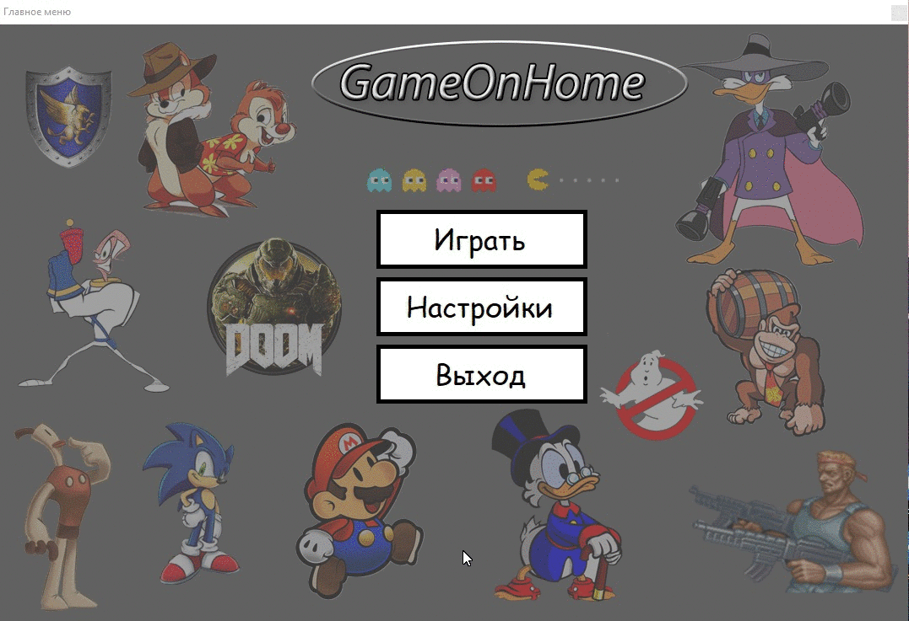
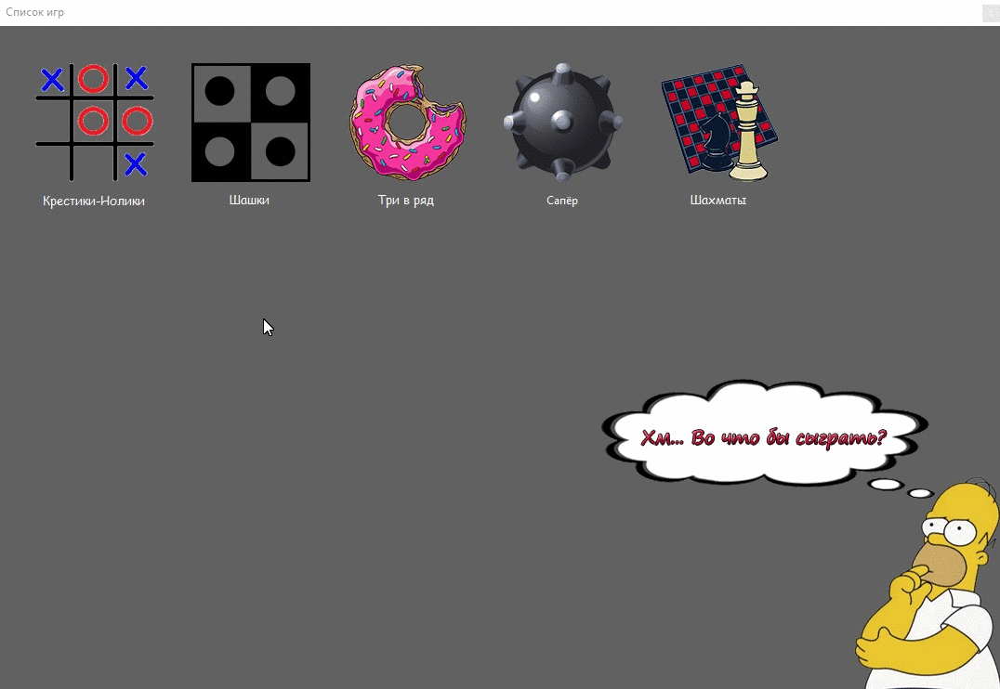

Status:  

Language: 

# Game On Home

## Данный проект является клиент-серверным приложением для игры в классические настольные игры. В данном проекте были реализованы крестики-нолики, шашки, шахматы, три в ряд, сапёр. 

Пример гэймплея:
 
 
 
 
 Невероятная игра в шашки против ИИ
 
 
 
 
## О проекте
	
### Данный проект является учебным, поэтому содержит некоторые баги, так как писался в сжатые сроки. 

### В проекте релазиован, как online так и offline режим игры. 

### Что бы поиграть в online режиме сервер должен быть запущен, после чего игроки запускают клиент и могут играть.
 
### К сожалению поиграть возможно только на 1 компьютере или в 1 локальной сети (Не тестировалось). 

### Так же стоит отметить что сервер способен обрабатывать только 2-ух пользователей одновременно, 
### но данные пользователи после присоединения к серверу способны играть в любые онлайн игры.   
	
**Теперь о проблемах:**  
:negative_squared_cross_mark:	1. ИИ противника в шахматах оставляет желать лучшего.    
:negative_squared_cross_mark:	2. Если в Windows поставить маштаб отображения более 100%, кнопки на форме сьедут.    
:negative_squared_cross_mark:	3. Для проекта не были написаны Unit тесты (нехватка времени)    
	
Примечание: ВСЯ музыка в играх не содержит авторских прав!

## Итоги и выводы

### В целом получился сыроватый проект, но был получен важный опыт работы в команде.

**Успехи**
:white_check_mark: * Написали простой игровой движок 
:white_check_mark: * Поработали с сетевым кодом, пускай и простым
:white_check_mark: * Продумали логику действий ИИ
:white_check_mark: * Поняли, что готовый игровой движок намного лучше самописного
:white_check_mark: * Научились в короткие сроки решать множественные задачи, находить выход из проблем

## Участники проекта

### Наша команда состояла из 3-ёх человек: 

### Бражник Дмитрий - написание кода, как клиентской так и серверной части.

### Еланский Александр - создание интерфейса, тестирование.

### Шаталин Дмитрий - 2Д дизайнер, написание документации, создание презентации и оформление проекта.

	
## Как запустить игру? 
	
### Для запуска игры скачайте папку по этой ссылке: <https://disk.yandex.ru/d/pNGn0saIxJ3YbQ>, 
### она содержит откомплированный проект, после чего запускайте GameOnHome.exe. 

**Приятного время припровождения в шашках!**  :grinning_face_with_big_eyes:
	
	